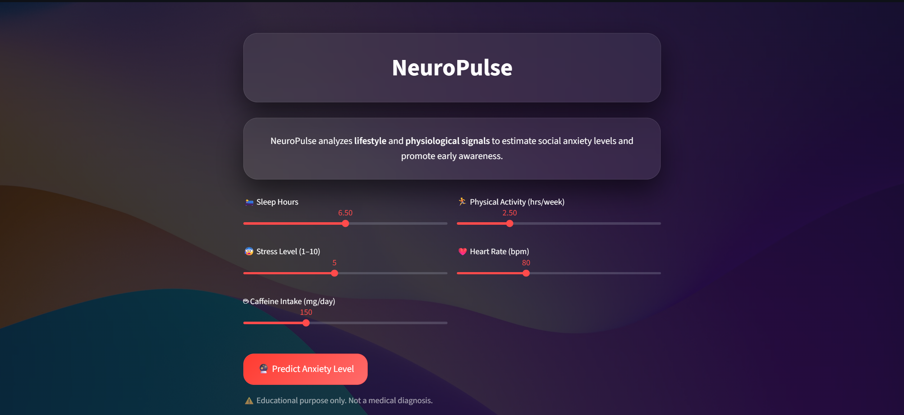
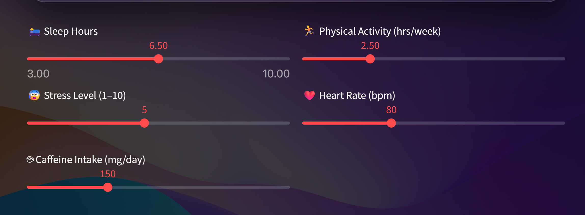
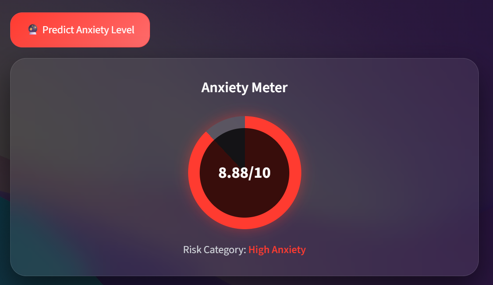
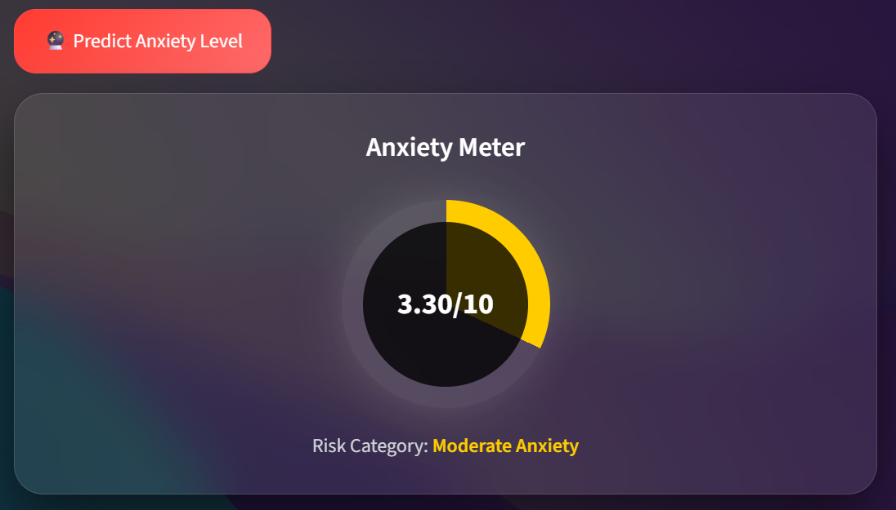
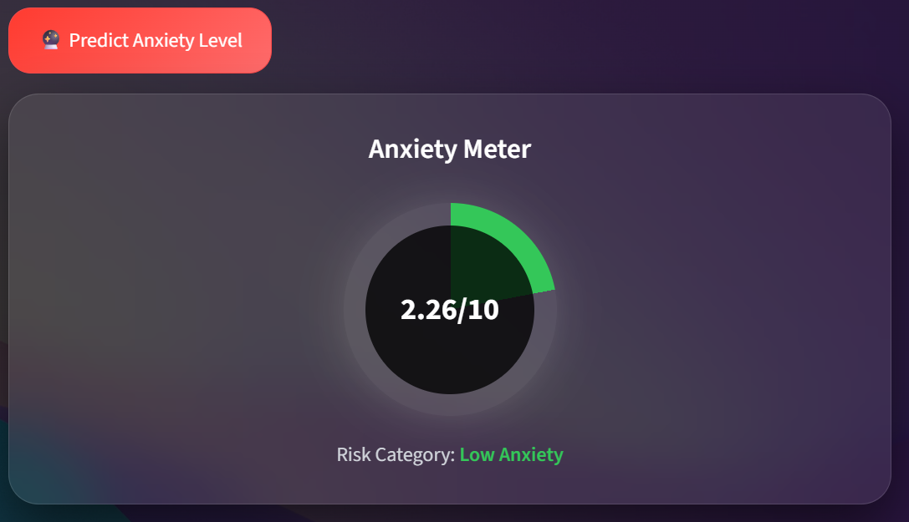
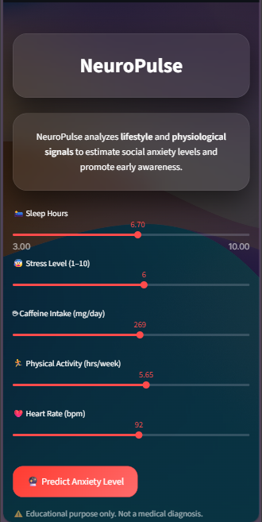

# 🧠 NeuroPulse – Social Anxiety Prediction System

NeuroPulse is an AI-powered web application that predicts **social anxiety levels** based on **lifestyle and physiological indicators**.  
The project demonstrates the application of **Applied Data Science** concepts combined with a **modern iOS-style UI**.

---

## 🚀 Features

- 📊 Predicts anxiety levels on a scale of **0–10**
- 🧠 Uses **machine learning (Random Forest / Regression-based model)**
- 🎛️ Inputs include:
  - Sleep hours
  - Physical activity
  - Stress level
  - Heart rate
  - Caffeine intake
- ✨ iOS-style **glassmorphism UI**
- 🔁 Animated anxiety meter with pulse effect for high anxiety
- 📱 Fully responsive (mobile & desktop)
- ☁️ Deployable on **Streamlit Cloud**

---

## 🛠️ Tech Stack

- **Python**
- **Streamlit** – Web framework
- **Scikit-learn** – Machine learning
- **NumPy** – Numerical computation
- **Joblib** – Model serialization
- **HTML & CSS** – Custom UI styling

---

## 📂 Project Structure

NeuroPulse/
│
├── app.py # Main Streamlit application
├── anxiety_model_5f.pkl # Trained ML model
├── scaler_5f.pkl # Feature scaler
├── requirements.txt # Project dependencies
└── README.md # Project documentation

---

## 📈 Model Overview

- The model is trained on lifestyle and physiological features
- Data preprocessing includes:
  - Feature selection
  - Scaling using StandardScaler
- The trained model predicts an **anxiety score (0–10)**
- Output is visualized using a circular animated anxiety meter

---

## 🎓 Academic Context

This project was developed as part of the **Applied Data Science** coursework and is intended for **educational purposes only**.

It demonstrates:

- Data preprocessing
- Feature scaling
- Model inference
- User-centric visualization
- Ethical ML presentation

---

## 📚 Reference & Acknowledgment

This project was developed with learning reference from the following publicly available Kaggle notebook:

- **Social Anxiety and Lifestyle Analysis**  
  https://www.kaggle.com/code/enesfiliz/social-anxiety-and-lifestyle-analysis

The referenced material was used **only for conceptual understanding and learning**.

---

## ⚠️ Disclaimer

This application is intended **only for educational and wellness insights**.  
It is **not a medical diagnostic tool** and should not be used as a substitute for professional mental health advice.

---

## 📸 Application Screenshots

### 🧠 Home Interface

### 🎛️ User Inputs

### 📊 Anxiety Prediction Output

### 📱 Mobile View

## 

## 👨‍💻 Author

**Vrushabh Deepak Shirke**  
Computer Engineering | Applied Data Science  
GitHub: https://github.com/Vrushabh-003

---
